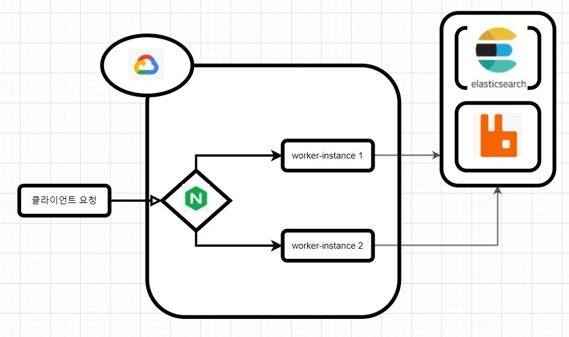

# Trace your child Servce REST API 설계

   
  
   

## 프로젝트 소개

  ### 자녀의 위치를 확인할수 있는 앱 서비스의 REST API를 설계하였습니다.
  ### 위치 확인 및 위험지역 안내 등의 기능

  
  

 

## 기술 스택

| SpringBoot | MySQL |  Spring data JPA   |  PostMan   | Docker | ElasticSearch | RabbitMQ | Nginx | Google Cloud Platform | 
| :--------: | :--------: | :--------: | :--------: | :--------: | :--------: | :--------: | :--------: | :--------: |
|   ![sb]    |   ![my]    |   ![dj]    |   ![pos]    |   ![dc]    |   ![es]    |   ![ra]    |   ![ng]    |   ![gc]    |       

| GitHub Webhook | jenkins |
| :--------: | :--------: |
|   ![gw]    |   ![jk]    |

 

## 간단한 설명

### 

 
### 

### 

 

## 총평

 ### RabbitMQ 와 ElasticSearch 등을 도입해서 프로젝트의 성능을 개선할수 있었습니다.
 ### Google Cloud Platform 사용으로, vm 인스턴스의 이해 -> 그에 기반되는 Linux 명령어 인지
 ### Docker를 통한 "코드형 인프라"의 개념 -> image를 통해 쉽게 인프라 구축이 가능합니다.
 ### nginx를 통한 리버스 프록시 도입 및 로드밸런싱환경을 구축했습니다.
 ### GitHub Webhook을 통한 Jenkins 자동 빌드,배포 파이프라인 구축
 
 

## 라이센스

MIT &copy; [NoHack](mailto:lbjp114@gmail.com)

<!-- Stack Icon Refernces -->

[sb]: /images/stack/springboot.svg
[my]: /images/stack/mysql.svg
[dj]: /images/stack/datajpa.svg
[pos]: /images/stack/postman.svg
[jm]: /images/stack/apachejmeter.svg
[dc]: /images/stack/docker.svg
[es]: /images/stack/elasticsearch.svg
[gc]: /images/stack/gcp.svg
[ng]: /images/stack/nginx.svg
[ra]: /images/stack/rabbitmq.svg
[gw]: /images/stack/github.svg
[jk]: /images/stack/jenkins-svgrepo-com.svg

